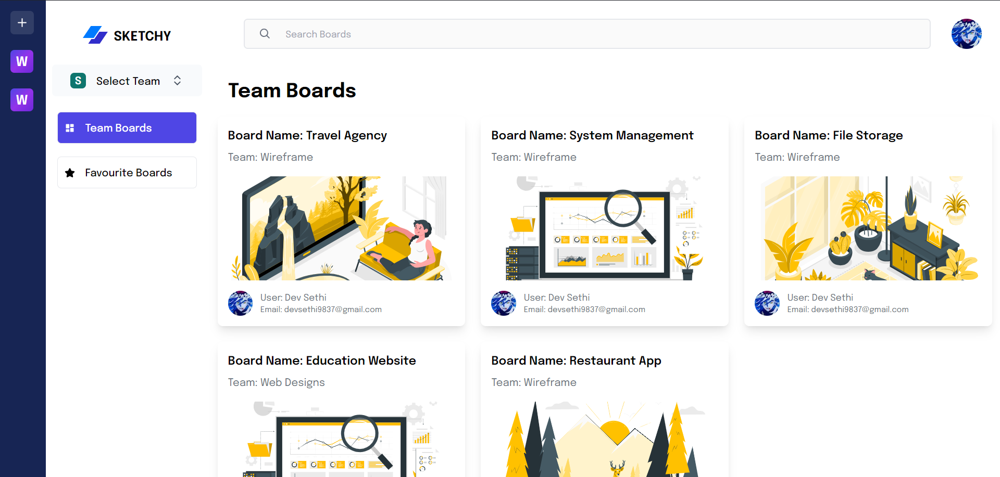
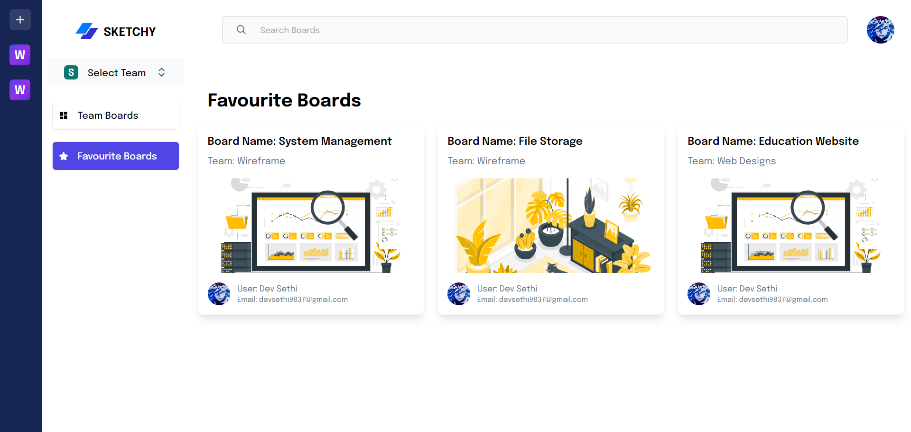
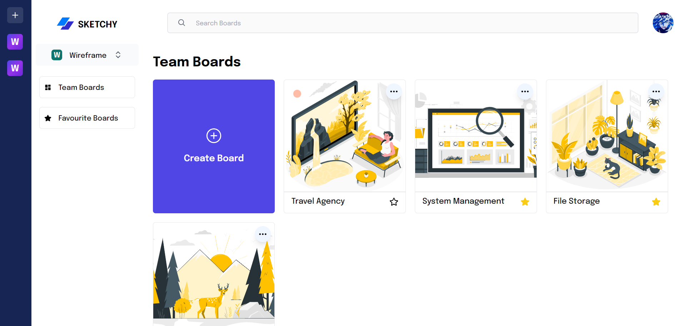
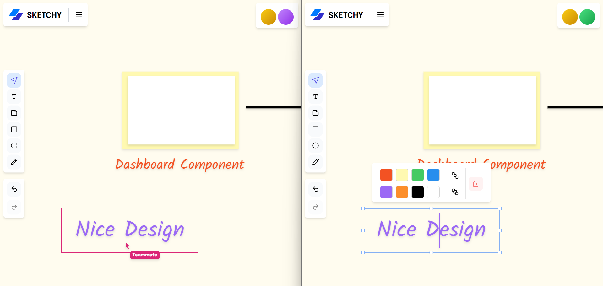
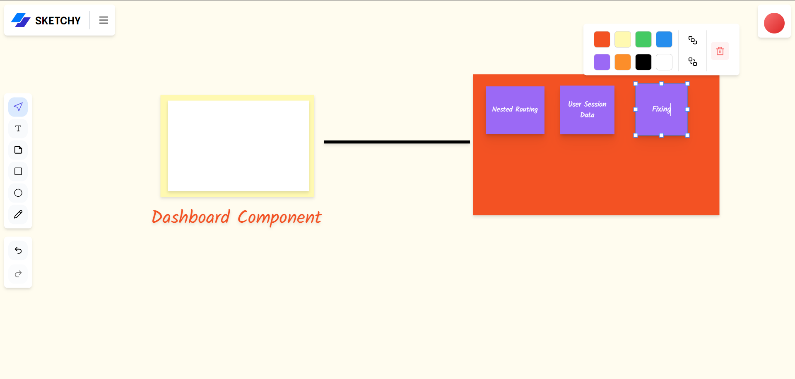

# Sketchy App with Next.js, Firebase, and Liveblocks

Welcome to the Sketchy App repository! This project is a Next.js-based web application designed to facilitate real-time collaboration on whiteboards among team members. Built with Next.js, Firebase, and Liveblocks, it allows users to create multiple teams, each with its own set of boards for collaboration. The app features a modern UI design with personal dashboards, favorite boards functionality, and a canvas whiteboard with various features.

## Demo

Check out the live demo of the Sketchy App [here](https://sketchy-app-five.vercel.app).

## Preview

### 1. User Dashboard



### 2. Favorite Boards



### 3. Select Team



### 4. Real-Time Collaborative Whiteboard with Teammate



### 5. Stunning Canvas Whiteboard with Multiple Features



## Features

- **User Authentication:** Login and register using NextAuth.js for secure authentication.
- **Team Creation:** Create multiple teams and invite team members for collaboration.
- **Board Management:** Create, view, and collaborate on boards with real-time updates.
- **Favorite Boards:** Add boards to favorites for quick access and organization.
- **Canvas Whiteboard:** Collaborate with team members on a canvas whiteboard with multiple features.
- **Personal Dashboard:** View user-specific information, teams, and favorite boards.
- **Modern UI Design:** Sleek layout and visually appealing design for an enjoyable user interface.

## Getting Started

To run the Sketchy App locally, follow these steps:

1. Clone the repository to your local machine:

   ```bash
   git clone https://github.com/Devsethi3/Sketchy-App.git
   ```

2. Navigate to the project directory:

   ```bash
   cd sketchy-app
   ```

3. Install the dependencies:

   ```bash
   npm install
   ```

4. Start the development server:

   ```bash
   npm run dev
   ```

5. Open your web browser and visit [http://localhost:3000](http://localhost:3000) to use the app.

## Usage

1. Login or register using the authentication feature.
2. Create or join teams and invite team members for collaboration.
3. Create boards within teams and start collaborating on the canvas whiteboard.
4. Add boards to favorites for quick access and organization.
5. Enjoy the modern UI design and collaborate in real-time with team members.

## Customization

Feel free to customize this project to fit your preferences. Update styles, colors, and layout in the Next.js components and CSS files. You can also extend the functionality to include additional features or customization options.

## Contributing

If you'd like to contribute to this project, please follow these steps:

1. Fork the repository.
2. Create a new branch for your feature or improvement.
3. Make your changes and commit them with descriptive messages.
4. Push your changes to your forked repository.
5. Open a pull request to merge your changes into the main branch.

Explore the Sketchy App, collaborate in real-time with team members on whiteboards, and consider contributing to its development. Thank you for checking out the repository!
